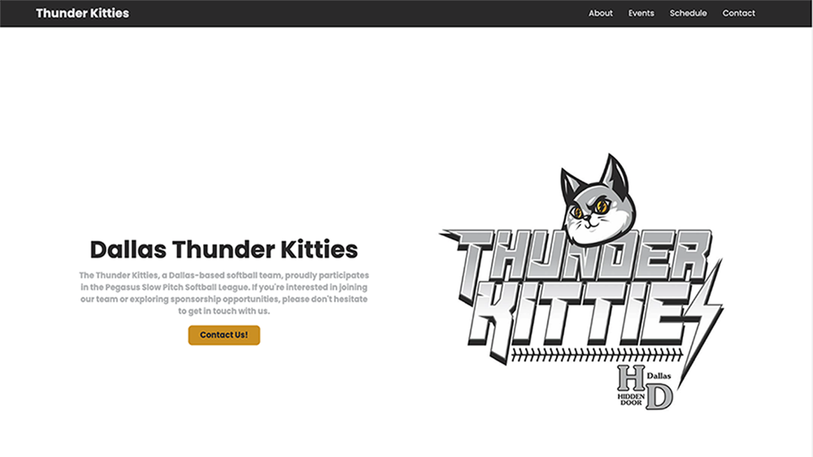

<div align='center'>


</div>

# Thunder Kitties Homepage

This is the homepage for the Dallas Thunder Kitties, a softball team in the Dallas, TX area.

## Stack

- [SvelteKit](https://kit.svelte.dev/)
- [TailwindCSS](https://tailwindcss.com/)
- [Vercel](https://vercel.com/)

## Contributing

Pull requests are welcome. For major changes, please open an issue first to discuss what you would like to change.

## Installation

```bash
npm install
```

## Development Server

```bash
npm run dev
```

## Deployment

Deployment is handled by Vercel. Any push to the `main` branch will trigger a deployment.

### Deployment URL

[https://thunderkitties.com](https://thunderkitties.com)

## License

[MIT](https://choosealicense.com/licenses/mit/)
